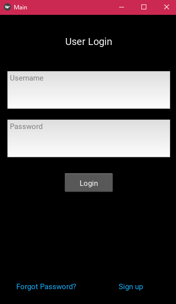
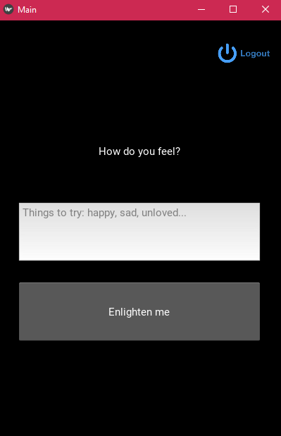
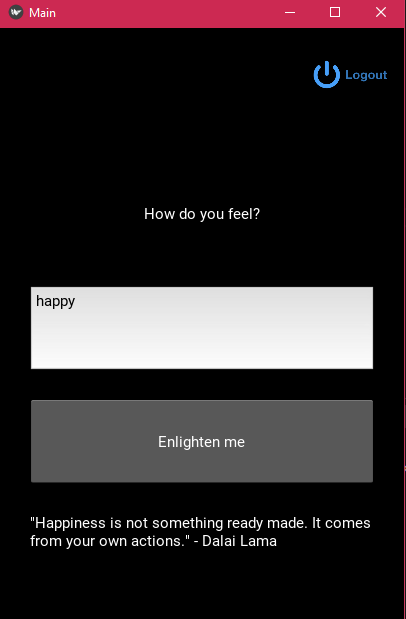
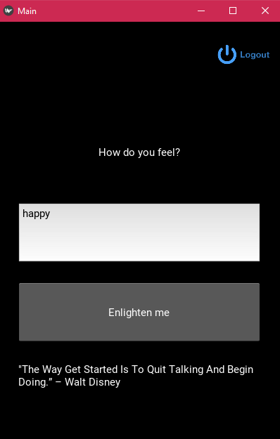
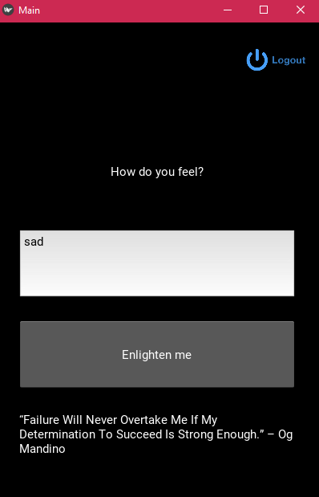
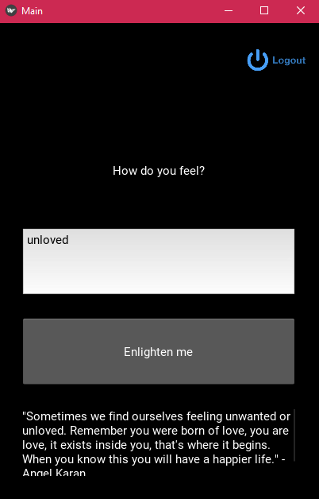
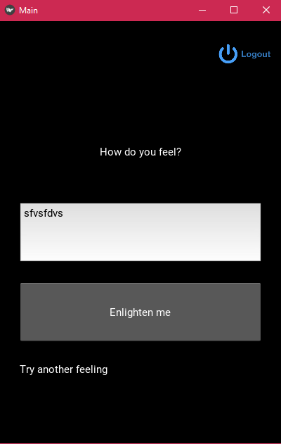
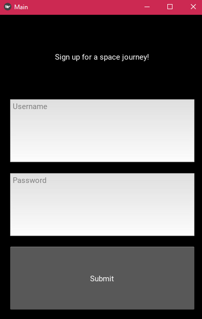

# TABLE OF CONTENTS

* Project description
* Framework
* Dependencies
* Screenshots

## Project Description

This mobile app provides sign up and login function.

The app should be able to produce random quotes when user inputs a feelings. 

Unknown feelings should be correctly handled.

## Framework

Kivy

## Dependencies
- glob
- pathlib

## Screenshots

